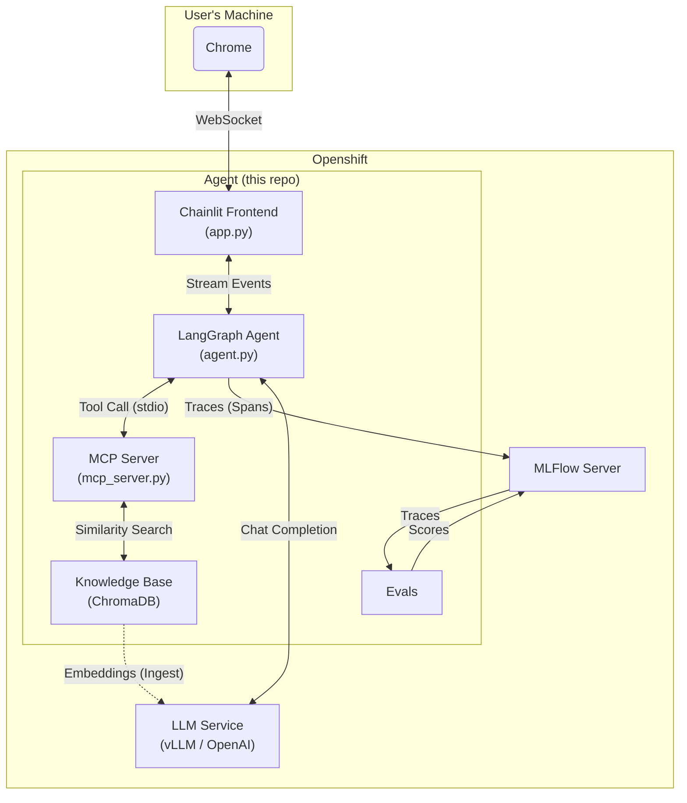
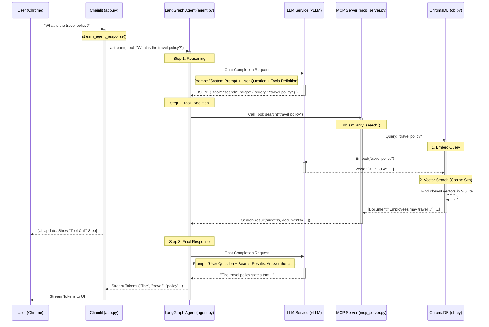
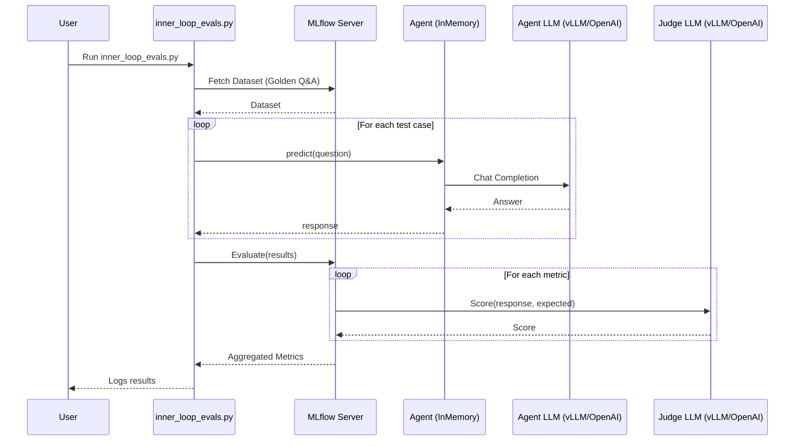
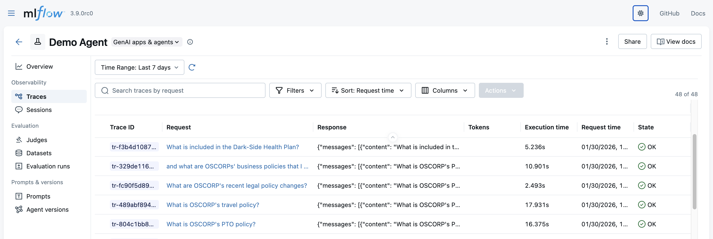
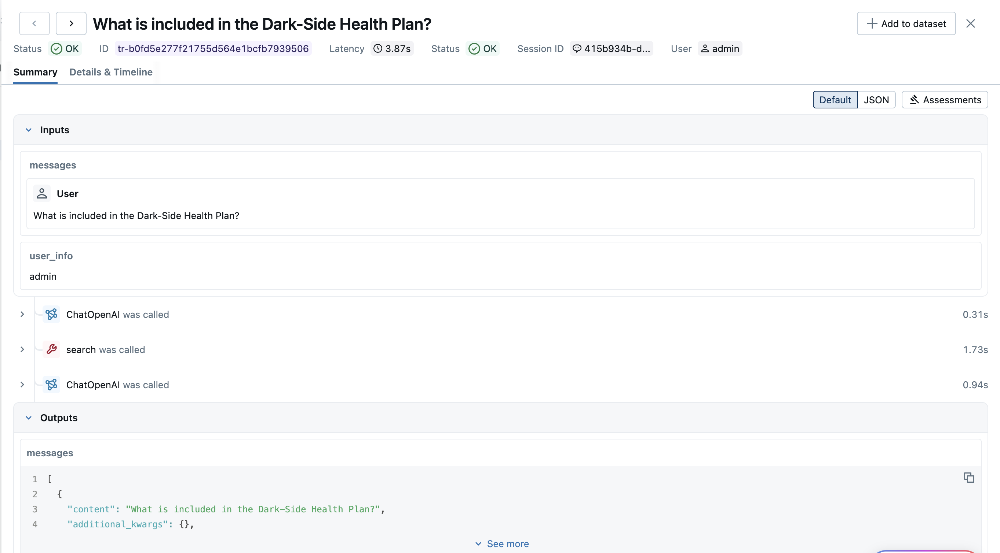
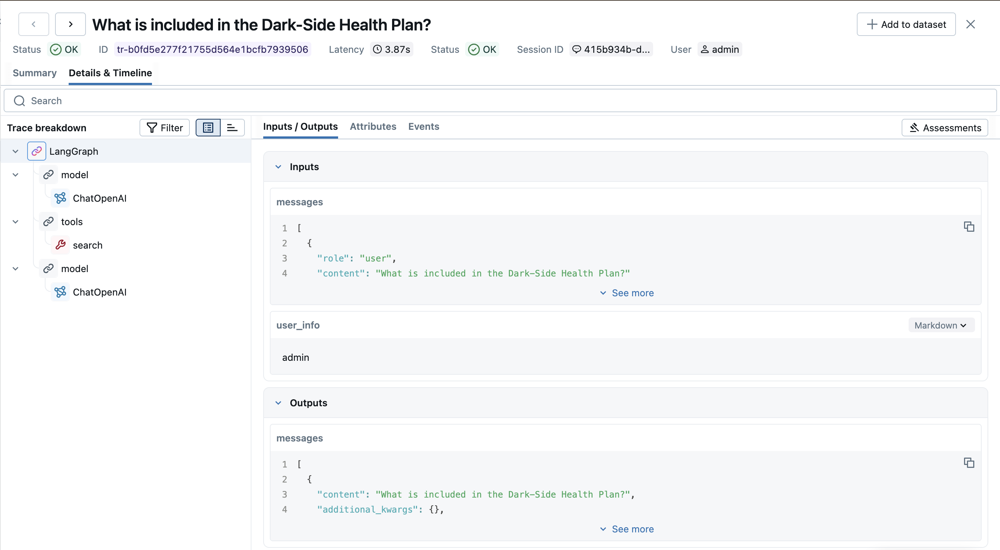
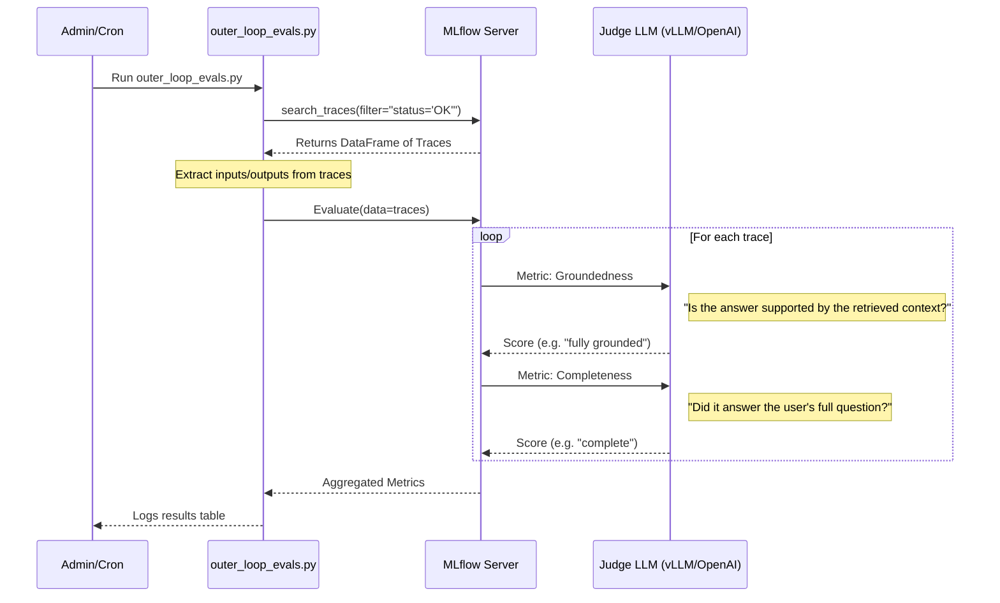

# Demo MLFlow Agent Tracing


## Table of Contents

- [Background](#background)
- [Architecture](#architecture)
- [Prerequisites](#prerequisites)
- [Local Installation](#local-installation)
- [Development Evaluation (Inner-Loop)](#development-evaluation-inner-loop)
  - [Generate Synthetic Evaluation Data](#generate-synthetic-evaluation-data)
  - [Run Evaluation](#run-evaluation)
- [Production Evaluation (Outer-Loop)](#production-evaluation-outer-loop)
  - [Start Chat Interface](#start-chat-interface)
  - [Review Traces](#review-traces)
  - [Run Evaluation](#run-evaluation-1)
- [Environment Variables](#environment-variables)

## Background

You work for OSCORP, an evil corporation bent on achieving world domination.
You've been tasked with building an agent to answer questions about OSCORP's corporate policies.
In [`public/oscorp_policies`](./public/oscorp_policies/) you'll find a collection of corporate memos about company policies written by Dr. Octavius, OSCORP's supervillan CEO.
An agent equipped with a tool to search these documents has already been created for you in [`src/demo_mlflow_agent_tracing/agent.py`](./src/demo_mlflow_agent_tracing/agent.py).

This repo will walk you through how to demonstrate, trace, and evaluate this agent using MLFlow.
You will learn how to:

- **Collect Traces**: Talk to the agent and collect/view live conversation traces.
- **Evaluate Your Agent During Development**: Evaluate the performance of your agent before you put it into production.
- **Evaluate Your Agent in Production**: Evaluate the performance of your agent on live traces from your production environment.

All of this trace logging is thanks to a one-liner from MLFlow:

```py
import mlflow

mlflow.langchain.autolog()
```

## Architecture



## User Chat - Sequence Diagram



## Prerequisites

- An LLM backend: either **OpenAI-compatible** (e.g. OpenAI, vLLM, Ollama) or **Vertex AI** (Claude on Vertex)
- (Optional) An OpenAI-compatible embeddings server for the knowledge base (e.g. OpenAI, vLLM, Ollama)
- A remote or local MLFlow server

## Local Installation

1. Clone the repository:

    ```sh
    git clone https://github.com/taagarwa-rh/demo_mlflow_agent_tracing.git
    cd demo_mlflow_agent_tracing
    ```

2. Copy `.env.example` to `.env` and fill in required environment variables:

    ```sh
    cp .env.example .env
    ```

    See the section on [Environment Variables](#environment-variables) for more details.

3. Install the dependencies:

    ```sh
    uv venv && uv sync
    ```

4. Ingest the vector database using the available script:

    ```sh
    uv run scripts/ingest.py
    ```

    **Ingestion Workflow:**

    ```mermaid
    sequenceDiagram
        participant User
        participant Script as ingest.py
        participant FS as File System
        participant DB as ChromaDB (db.py)
        participant Embed as Embedding Model (Ollama/nomic-embed-text)

        User->>Script: Run ingest.py
        Script->>FS: Read *.md files
        FS-->>Script: Content
        Script->>DB: db.add_documents(docs)
        loop For each document
            DB->>Embed: Embed(text)
            Note right of Embed: Uses LLM (e.g. nomic-embed-text)
            Embed-->>DB: Vector
            DB->>DB: Store (Vector, Text)
        end
        Script-->>User: Done
    ```

5. If you do not have a remote MLFlow server to connect to, you can start one up locally.

    ```sh
    uv run mlflow server
    ```

## Development Evaluation (Inner-Loop)

### Generate Synthetic Evaluation Data

Inner-loop evaluation covers the eval scope typically occupied by the data scientist or AI engineer.
These evals help answer the question, "Am I ready to deploy this agent to production?"

Typically you would start by collecting a set of test cases for your use case, consisting of input and expected output pairs.
Then you'd define some metrics to measure the success of your agent on those test cases, like correctness, safety, helpfulness, etc.
Finally, you'd run your agent on the test cases and measure the results with your metrics.

With MLFlow, you can store test cases, create metrics, and perform inner-loop evaluation on your agent.

First, generate a synthetic dataset of test cases using the [`scripts/generate_eval_dataset.py`](./scripts/generate_eval_dataset.py) script.
Each test case in this dataset will be a pair of `"inputs"` and `"expectations"`.
The `"inputs"` in this case is just a question, e.g. "Where are travelers required to check-in when travelling for OSCORP?".
The `"expectations"` has two parts, one is the `"expected_response"` which contains the correct answer to the question, and the other is the `"expected_document"`, which is the document that contains this answer.

Run:

```sh
uv run scripts/generate_eval_dataset.py
```

After running the above script, visit your MLFlow server and navigate to your experiment > Datasets. You should see your dataset appear as below.


### Run Evaluation

Now you can run an evaluation to see how the agent performs on these test cases using the [`scripts/inner_loop_evals.py`](./scripts/inner_loop_evals.py) script.
This uses MLFlow's built in evaluation functionality to evaluate the agent's performance on the test cases in 5 distinct ways:

1. **Correctness**: Checks that the agent's response accurately supports the expected response.
2. **Completeness**: Checks that the agent's response is complete and fully addresses the user's request.
3. **Relevance**: Checks that the response is fully relevant to the user's query and does not contain extraneous information.
4. **Retrieval**: Checks that the document containing the required information was retrieved by the agent.
5. **MinimalToolCalls**: Checks that the agent required just one tool call to answer the question.

Run: 

```sh
uv run scripts/inner_loop_evals.py
```

After running the above script, visit your MLFlow server and navigate to your experiment > Evaluation runs. You should see your evaluation results as below:


**Inner Loop Evaluation Workflow:**



**LLM-as-a-Judge:**
This process uses a separate LLM call (the "Judge") to grade the Agent's output. Instead of writing complex regex rules to check if an answer is "correct", we simply ask the Judge: *"Here is the correct answer: X. The agent answered: Y. Is Y correct? Rate 1-5."* This allows for nuanced grading of semantic meaning.

## Production Evaluation (Outer-Loop) 

### Start Chat Interface

You can chat with the agent using the available chainlit interface.
If you want to start a new conversation, click the pencil and paper icon in the top left corner.

The agent has one tool available to it.

1. `search`: Search the knowledge base for answers to your questions.

To start up the agent locally, run

```sh
uv run chainlit run src/demo_mlflow_agent_tracing/app.py
```

### Review Traces

Any conversation you have with the agent or run through evaluations is automatically traced and exported to MLFlow.

You can review traces by accessing your experiment through the MLFlow UI.
Just go to Experiments > Your experiment > Traces








### Run Evaluation

**Outer Loop Evaluation Workflow:**




## Environment Variables

Set `LLM_PROVIDER` to `openai` or `vertex`, then set the variables for that provider. All other LLM-related vars are conditional on the chosen provider.

| Variable                             | Required | Default                 | Description                                                                                              |
| ------------------------------------ | -------- | ----------------------- | -------------------------------------------------------------------------------------------------------- |
| LLM_PROVIDER                         | No       | `openai`                | Which LLM backend to use: `openai` or `vertex`.                                                           |
| OPENAI_API_KEY                       | When `openai` | `None`             | API key for OpenAI-compatible server.                                                                    |
| OPENAI_MODEL_NAME                    | When `openai` | `None`             | Name of the LLM to use (e.g. `gpt-4o`, `qwen3:8b`).                                                       |
| OPENAI_BASE_URL                      | No       | `None`                  | Base URL for your OpenAI-compatible server. Optional.                                                     |
| VERTEX_PROJECT_ID                    | When `vertex` | `None`              | GCP project ID for Vertex AI (Claude on Vertex).                                                         |
| VERTEX_REGION                       | When `vertex` | `None`              | Vertex AI region (e.g. `us-central1`).                                                                   |
| VERTEX_MODEL_NAME                   | When `vertex` | `None`              | Claude model name on Vertex (e.g. `claude-3-5-sonnet@20241022`).                                         |
| CHAINLIT_AUTH_SECRET                 | No       | `None`                  | Authorization secret for Chainlit chat UI (optional). Generate with `chainlit create-secret` when using the web app. |
| MLFLOW_TRACKING_URI                  | No       | `http://localhost:5000` | URI for the MLFlow tracking server.                                                                      |
| MLFLOW_EXPERIMENT_NAME               | No       | `Default`               | Name of the MLFlow experiment to log traces/datasets to.                                                 |
| MLFLOW_SYSTEM_PROMPT_URI             | No       | `None`                  | System prompt URI from the MLFlow server. If not set, a default system prompt will be used.              |
| MLFLOW_GENAI_EVAL_MAX_WORKERS        | No       | `10`                    | Maximum number of parallel workers when running evaluations.                                             |
| MLFLOW_GENAI_EVAL_MAX_SCORER_WORKERS | No       | `10`                    | Maximum number of parallel workers when scoring model outputs during evaluations.                        |
| EMBEDDING_API_KEY                    | No       | `None`                  | API key for the OpenAI-compatible embeddings server (optional).                                          |
| EMBEDDING_MODEL_NAME                 | No       | `None`                  | Name of the embedding model to use (optional).                                                            |
| EMBEDDING_BASE_URL                   | No       | `None`                  | Base URL for your OpenAI-compatible embeddings server (optional).                                        |
| EMBEDDING_SEARCH_PREFIX              | No       | ` `                     | Prefix to add to each embeddings search query prior to embedding.                                        |
| EMBEDDING_DOCUMENT_PREFIX            | No       | ` `                     | Prefix to add to each embeddings document prior to embedding.                                            |
