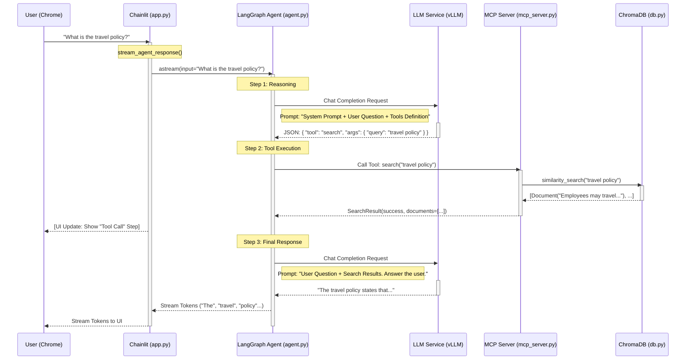

```mermaid
sequenceDiagram
    participant User as User (Chrome)
    participant Chainlit as Chainlit (app.py)
    participant Agent as LangGraph Agent (agent.py)
    participant LLM as LLM Service (vLLM)
    participant MCP as MCP Server (mcp_server.py)
    participant DB as ChromaDB (db.py)

    User->>Chainlit: "What is the travel policy?"
    activate Chainlit
    
    Note over Chainlit: stream_agent_response()
    Chainlit->>Agent: astream(input="What is the travel policy?")
    activate Agent
    
    Note over Agent: Step 1: Reasoning
    Agent->>LLM: Chat Completion Request
    Note right of Agent: Prompt: "System Prompt + User Question + Tools Definition"
    activate LLM
    LLM-->>Agent: JSON: { "tool": "search", "args": { "query": "travel policy" } }
    deactivate LLM
    
    Note over Agent: Step 2: Tool Execution
    Agent->>MCP: Call Tool: search("travel policy")
    activate MCP
    MCP->>DB: similarity_search("travel policy")
    activate DB
    DB-->>MCP: [Document("Employees may travel..."), ...]
    deactivate DB
    MCP-->>Agent: SearchResult(success, documents=[...])
    deactivate MCP
    
    Chainlit-->>User: [UI Update: Show "Tool Call" Step]
    
    Note over Agent: Step 3: Final Response
    Agent->>LLM: Chat Completion Request
    Note right of Agent: Prompt: "User Question + Search Results. Answer the user."
    activate LLM
    LLM-->>Agent: "The travel policy states that..."
    deactivate LLM
    
    Agent-->>Chainlit: Stream Tokens ("The", "travel", "policy"...)
    Chainlit-->>User: Stream Tokens to UI
    
    deactivate Agent
    deactivate Chainlit
```